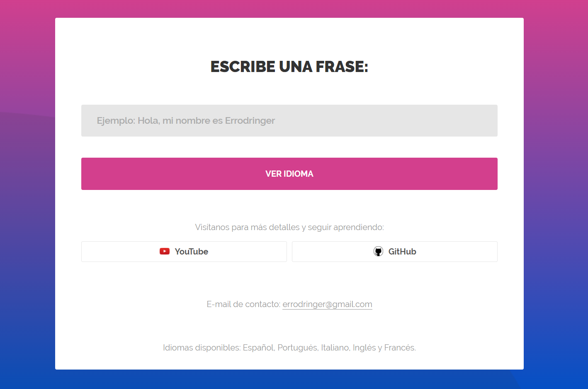

# Detector de idiomas con IA en Python

_Aplicación web hecha en Flask y Python con Inteligencia Artificial que detecta idiomas_




### Pre-requisitos 📋 

_Tener instalado en nestro equipo Python_

_Librerías de Python utilizadas:_

```
- flask
- sklearn
```

### Instalación 🔧 

_Para instalar Python:_


```
https://www.python.org/downloads/
```

_Para instalar librerías:_

```
https://youtu.be/HlmUaYKjjZc
```

## Autores ✒️

_Autores del proyecto:_

* **Errodringer** - *Programación y edición* - [Errodringer](https://www.youtube.com/c/Errodringer?sub_confirmation=1)

## Licencia 📄 

Este proyecto es divulgativo. Solo para uso personal, aprendizaje y entretenimiento.

## Expresiones de Gratitud 🎁 

* Muchas gracias a todos!
* Comenta a otros sobre este proyecto y difunde! 📢 
*  🤓  

